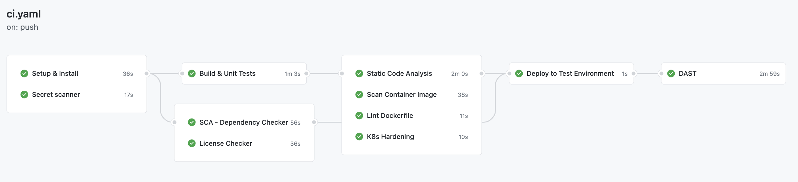

# [Java] [GitHub Actions] Secure Pipelines Demo

Sample Secure Pipeline with GithHub Actions - Ideal for Open Source Projects

## Setup

- Add Snyk API Token in GitHub Repositority Secrets - SNYK_TOKEN
- Add Git Guardian API Token for in GitHub Repositority Secrets - GITGUARDIAN_API_KEY

## Actions Used

| Step                     | Github Action                                                                            | Comments | Open Source Alternative                             |
| ------------------------ | ---------------------------------------------------------------------------------------- | -------- | --------------------------------------------------- |
| Secrets Scanner          | [GitGuardian](https://github.com/GitGuardian/gg-shield-action)                           |          | [truffleHog](https://github.com/dxa4481/truffleHog) |
| SCA - Dependency Checker | [snyk](https://github.com/marketplace/actions/snyk)                                      |          | OWASP Dependency Check                              |
| Static Code Analysis     | [Spot Bugs](https://github.com/jwgmeligmeyling/spotbugs-github-action)                   |          |                                                     |
| Static Code Analysis     | [CodeQL](https://github.com/github/codeql-action)                                        |          |                                                     |
| Container Scan           | [Anchore](https://github.com/marketplace/actions/anchore-container-scan)                 |          |                                                     |
| Container Lint           | [Dockle](https://github.com/marketplace/actions/runs-dockle)                             |          |                                                     |
| K8s Hardening            | [Dockle](https://github.com/marketplace/actions/controlplane-kubesec)                    |          |                                                     |
| License Checker          | [License finder](https://github.com/pivotal/LicenseFinder)                               |          |                                                     |
| DAST                     | [OWASP ZAP Basline Scan](https://github.com/marketplace/actions/owasp-zap-baseline-scan) |          |                                                     |
|                          |                                                                                          |          |                                                     |

# Pipeline

